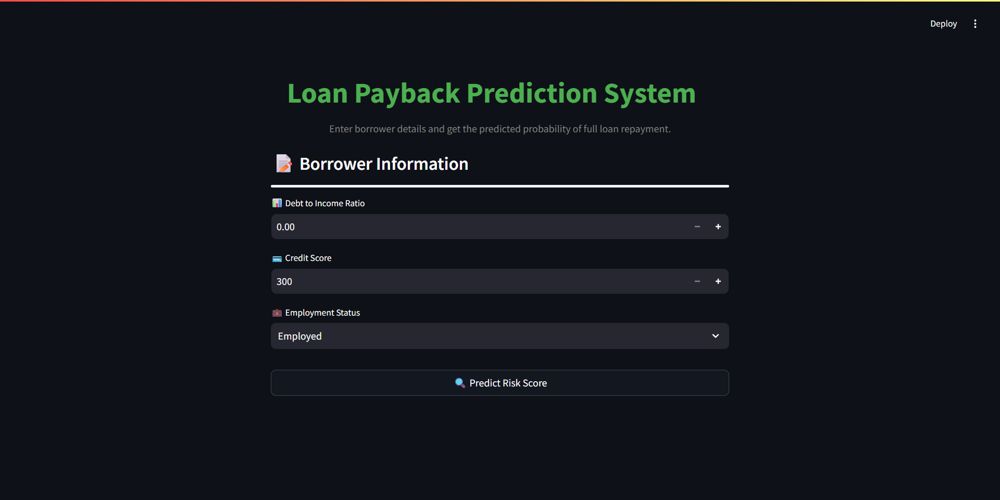
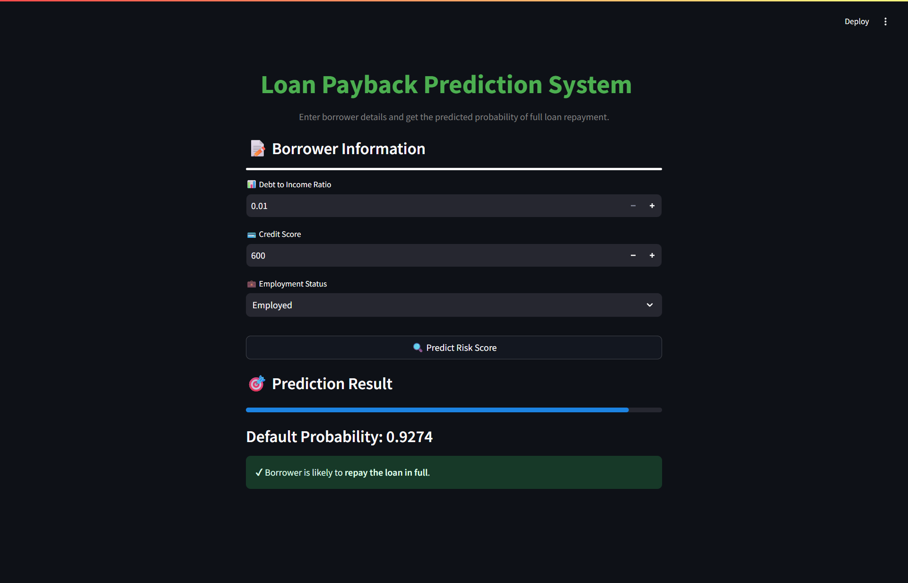

# 💰 Loan Payback Predicting System (Machine Learning + Streamlit)

This project is a machine learning–powered web application built using **Python**, **CatBoost**, and **Streamlit** to predict the likelihood that a borrower will fully repay a loan.
Users enter financial and credit-related information, and the model returns a probability score along with a repayment prediction.

## 🚀 Features

- Predicts loan repayment probability using key financial indicators.
- Built using a trained **CatBoostClassifier**.
- Interactive UI created with **Streamlit**.
- Automatic feature engineering (e.g., credit-to-DTI interaction).
- Lightweight, fast, and deployable on any machine with Python.
- Includes a pre-trained model: `catboost_credit_model.pkl`.

## 📊 Input Parameters

The app collects the following user inputs:

- **Debt-to-Income Ratio**
- **Credit Score**
- **Employment Status**
  - Employed
  - Unemployed
  - Self-Employed
  - Student
  - Other
- **Credit–DTI Interaction Feature**
  - Automatically calculated inside the app

## 🧰 Technologies Used

- **Python**
- **CatBoost** – Core ML Model
- **Pandas / NumPy** – Data preprocessing
- **Streamlit** – Web UI framework
- **Pickle** – Model serialization
- **Jupyter Notebook** – Model training & evaluation

## 📁 Files Included

- `app.py` – Streamlit frontend app
- `model/catboost_credit_model.pkl` – Trained CatBoost model
- `model/catboost_model.ipynb` – Notebook used to train and export the model
- `README.md` – Project documentation
- `requirements.txt` – Dependencies list

## ⚙️ Installation & Setup

1. Clone the repository:

   ```bash
   git clone https://github.com/Kalana-S/Loan-Payback-Predicting-System.git
   cd Loan-Payback-Predicting-System
   ```

2. Create virtual environment (optional but recommended):

   ```bash
   python -m venv venv
   venv\Scripts\activate   # For Windows
   # OR
   source venv/bin/activate  # For macOS/Linux
   ```

3. Install dependencies:

   ```bash
   pip install -r requirements.txt
   ```

4. Run the Flask app:

   ```bash
   streamlit run streamlit_app.py
   ```

5. Open your browser and go to `http://localhost:8501`

## 📸 Screenshots

**Home Page**


**Prediction**


## 🤝 Contribution

Contributions, issues, and feature requests are welcome!
Feel free to open a pull request or start a discussion.

## 📜 License

This project is licensed under the MIT License – see the `LICENSE` file for details.
